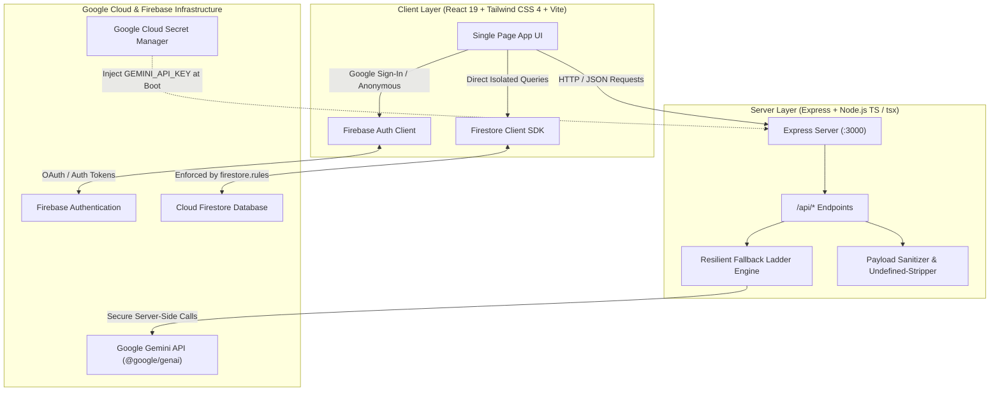
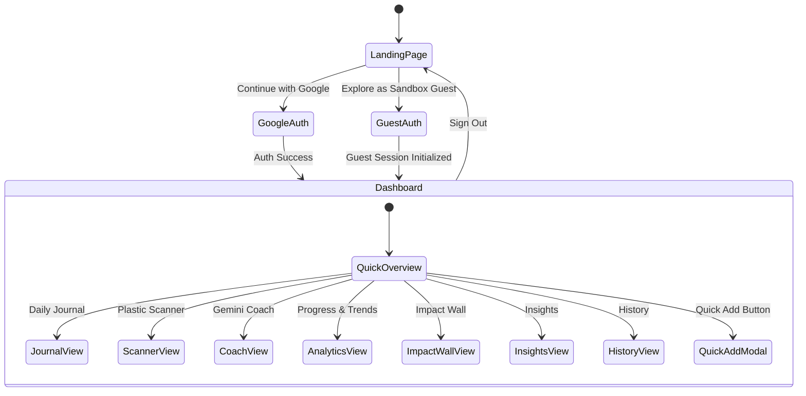
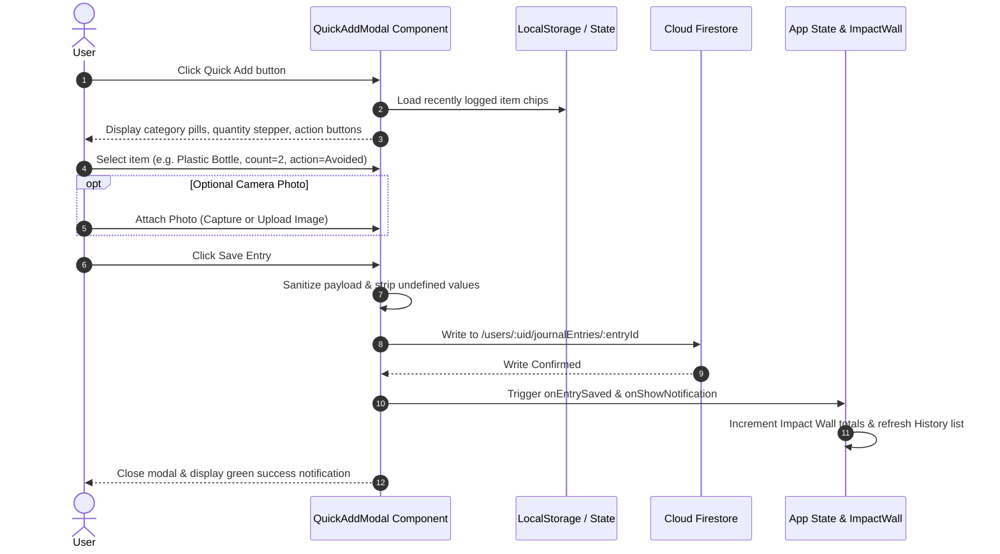
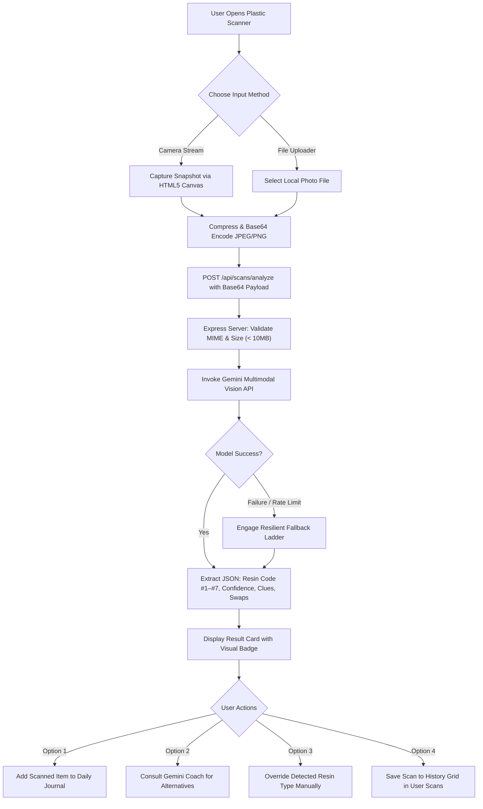
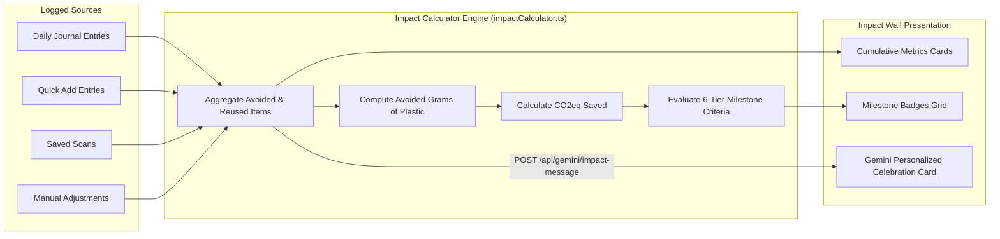
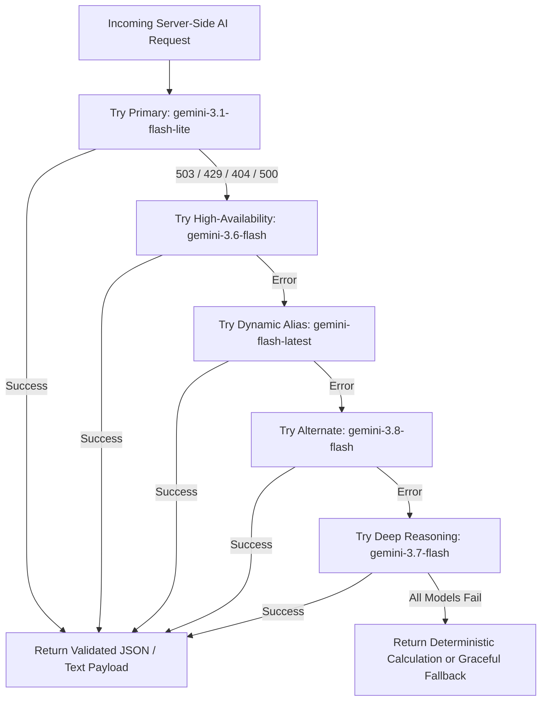

# Plastic Consumption Tracker & AI Sustainability Companion

A production-ready, user-authenticated full-stack web application powered by **Google Gemini** multimodal AI and **Google Cloud Firestore** to help users track, understand, and reduce their daily single-use plastic footprint.

[](https://cloud.google.com/run)
[](https://ai.google.dev/)
[](https://firebase.google.com/)
[](https://react.dev/)
[](https://tailwindcss.com/)
[](https://www.typescriptlang.org/)

---

## Table of Contents

1. [Project Overview & Core Features](#1-project-overview--core-features)
2. [Visual Architecture & Flow Diagrams](#2-visual-architecture--flow-diagrams)
   - [System Architecture Diagram](#system-architecture-diagram)
   - [User Journey & Navigation Flow](#user-journey--navigation-flow)
   - [Quick Add & Rapid Logging Flow](#quick-add--rapid-logging-flow)
   - [Plastic Scanner & Gemini Vision Flow](#plastic-scanner--gemini-vision-flow)
   - [Impact Wall & Milestone Progression Flow](#impact-wall--milestone-progression-flow)
   - [Resilient AI Model Fallback Ladder Flow](#resilient-ai-model-fallback-ladder-flow)
3. [Repository Directory Map & Code Guide](#3-repository-directory-map--code-guide)
4. [Backend API Reference](#4-backend-api-reference)
5. [Local Development & Testing Guide](#5-local-development--testing-guide)
   - [Prerequisites](#prerequisites)
   - [Step-by-Step Local Setup](#step-by-step-local-setup)
   - [Verifying Build & Automated Linting](#verifying-build--automated-linting)
   - [Testing Backend Endpoints via cURL](#testing-backend-endpoints-via-curl)
   - [End-to-End Functional Browser Walkthrough](#end-to-end-functional-browser-walkthrough)
6. [Agentic Threat Model & Security Directives](#6-agentic-threat-model--security-directives)
7. [Cloud Firestore Security Rules](#7-cloud-firestore-security-rules)
8. [Production Deployment to Google Cloud Run](#8-production-deployment-to-google-cloud-run)
   - [Secret Manager Setup](#secret-manager-setup)
   - [Deploying to Cloud Run](#deploying-to-cloud-run)
   - [Mandatory Challenge Campaign Verification](#mandatory-challenge-campaign-verification)

---

## 1. Project Overview & Core Features

Plastic Consumption Tracker transforms personal plastic awareness into actionable, sustainable habits without judgment or friction:

- **⚡ Quick Add Modal (3-Second Log)**: One-click rapid logging from any screen with category chips (bottles, cups, grocery bags, takeout containers, cling wrap), instant count steppers, action toggles (*Avoided* vs *Used* vs *Reused*), and optional photo capture.
- **📖 Natural Language Daily Journal**: Users write freely (e.g., *"Grabbed an iced coffee with a plastic straw and bought takeout in a styrofoam clamshell, but refused the plastic bag"*). Gemini parses unstructured text into discrete items with resin estimations, quantities, and cost-effective alternatives.
- **📷 Plastic Scanner with Gemini Multimodal Vision**: In-browser live camera capture or high-resolution upload. Identifies resin identification codes (**PETE #1, HDPE #2, PVC #3, LDPE #4, PP #5, PS #6, OTHER #7**), computes confidence ratings, identifies visual cues, and offers local recycling and sustainable alternatives.
- **💬 Sprout — Gemini Sustainability Coach**: A supportive, budget-aware conversational assistant that offers practical reuse tips, zero-waste swaps, and bulk shopping advice with complete chat memory.
- **🏆 Impact Wall & Cumulative Milestones**: Dynamic visualization of environmental achievements. Tracks cumulative single-use plastics diverted from waterways and landfills, unlocks milestone badges (*First Step*, *Plastic Pioneer*, *Bag Buster*, *Eco Guardian*, *Zero-Hero*, *Century Champion*), supports manual adjustments, and generates personalized AI celebration messages.
- **📊 Analytics & Trend Reports**: Interactive breakdown of plastic categories, weekly/monthly avoidance ratios, frequent culprits, and automated AI historical summaries.
- **🛡️ Enterprise Security & Privacy**: Zero Insecure Defaults in Firestore rules, owner-bound data isolation, automated undefined-stripping to eliminate Firestore crashes, and server-side secret management.

---

## 2. Visual Architecture & Flow Diagrams

### System Architecture Diagram



---

### User Journey & Navigation Flow



---

### Quick Add & Rapid Logging Flow



---

### Plastic Scanner & Gemini Vision Flow



---

### Impact Wall & Milestone Progression Flow



---

### Resilient AI Model Fallback Ladder Flow



---

## 3. Repository Directory Map & Code Guide

```
plastic-consumption-tracker/
├── .env.example                 # Environment variables specification
├── firestore.rules              # Zero-insecure-defaults owner-isolated Firestore rules
├── index.html                   # HTML entry point with synchronized title & viewport
├── metadata.json                # Project capabilities and frame permissions
├── package.json                 # Dependency manifest and lifecycle scripts
├── server.ts                    # Full-stack Express server with Gemini routes & Vite middleware
├── tsconfig.json                # TypeScript compiler configuration
├── tsconfig.node.json           # Node TypeScript configuration
├── vite.config.ts               # Vite bundler configuration with Tailwind CSS plugin
└── src/
    ├── App.tsx                  # Root application component, routing state, global toasts
    ├── index.css                # Global styling with @import "tailwindcss"
    ├── main.tsx                 # React DOM mount point
    ├── types.ts                 # Strongly typed domain models, schemas, and enums
    ├── lib/
    │   ├── firebase.ts          # Firebase SDK initialization, Auth, & Firestore CRUD
    │   └── impactCalculator.ts  # Scientific formulas for plastic grams, CO2, & badge tiers
    └── components/
        ├── AnalyticsSection.tsx     # Visual trends, category breakdowns, avoidance ratios
        ├── CompanionChat.tsx        # Sprout AI chat assistant with multi-turn memory
        ├── HistorySection.tsx       # Searchable, filterable audit log of entries
        ├── ImpactWallSection.tsx    # Cumulative achievements, milestone badges, & AI cheers
        ├── InsightsSection.tsx      # Weekly & Monthly historical AI synthesis reports
        ├── JournalSection.tsx       # Natural language text journal & item extraction review
        ├── LandingPage.tsx          # Unauthenticated landing, value cards, & auth triggers
        ├── Navbar.tsx               # Top header, active navigation, user avatar, quick add
        ├── PlasticScannerSection.tsx# Live camera stream, file upload, & Gemini Vision analysis
        └── QuickAddModal.tsx        # Lightweight 3-second logging modal with photo support
```

### Detailed Component Roles

| File | Purpose & Responsibilities |
| :--- | :--- |
| `server.ts` | Hosts all backend endpoints, manages Gemini GenAI SDK client, implements the resilient model fallback ladder, handles file uploads safely with `path.basename`, and mounts Vite middleware in dev or static files in production. |
| `src/App.tsx` | Coordinates top-level tab state (`journal`, `scanner`, `chat`, `analytics`, `impact`, `insights`, `history`), manages authentication state, controls the `QuickAddModal` overlay, and renders global notifications. |
| `src/lib/firebase.ts` | Configures Firebase Auth and Firestore with an automated undefined-stripping utility (`sanitizePayload`) so that omitted fields never crash Firestore write transactions. |
| `src/lib/impactCalculator.ts` | Encapsulates weight formulas (e.g. 5g per bag, 20g per bottle, 25g per container), degradation spans (20 to 450 years), CO2 impact (6kg CO2eq per kg plastic), and 6 milestone tiers. |
| `src/components/QuickAddModal.tsx` | Provides rapid logging in under 3 seconds. Pre-populates quick item chips, supports camera snapshots, stepper adjustments, and auto-syncs with Firestore. |
| `src/components/PlasticScannerSection.tsx` | Implements HTML5 canvas video stream captures and image file uploads, calls `/api/scans/analyze`, displays resin codes (#1–#7), and provides direct routes to the Journal or Companion Coach. |
| `src/components/ImpactWallSection.tsx` | Aggregates all user avoidance actions, manages user manual overrides, calculates milestone progress bars, and fetches AI-generated celebration messages. |
| `src/components/CompanionChat.tsx` | Provides a non-judgmental, budget-friendly AI sustainability coach with persistent Firestore conversation storage and quick question prompts. |

---

## 4. Backend API Reference

All AI operations and image handling run server-side via Express on port `3000`.

### Health Check
- **Endpoint**: `GET /api/health`
- **Response**: `{"status": "ok", "timestamp": 1741160000000}`

### Item Extraction from Natural Language Journal
- **Endpoint**: `POST /api/gemini/extract-items`
- **Request Body**:
  ```json
  { "text": "Had an iced coffee with a plastic straw and bought salad in a plastic box, but avoided the bag." }
  ```
- **Response**:
  ```json
  {
    "items": [
      { "name": "Plastic straw", "category": "utensils_straws", "quantity": 1, "action": "used", "plasticType": "PP (#5)", "confidence": "high", "alternatives": ["Reusable stainless steel or bamboo straw"] },
      { "name": "Plastic grocery bag", "category": "bags", "quantity": 1, "action": "avoided", "plasticType": "LDPE (#4)", "confidence": "high", "alternatives": ["Cotton tote bag"] }
    ]
  }
  ```

### Journal Reflection Generation
- **Endpoint**: `POST /api/gemini/reflect`
- **Request Body**:
  ```json
  {
    "entryText": "Used a plastic fork at lunch today.",
    "items": [{ "name": "Plastic fork", "category": "utensils_straws", "quantity": 1, "action": "used" }]
  }
  ```
- **Response**:
  ```json
  { "reflection": "Every piece of plastic logged brings greater awareness. Keeping a small travel fork in your bag is an effortless swap for tomorrow!" }
  ```

### Sustainability Coach Chat
- **Endpoint**: `POST /api/gemini/chat`
- **Request Body**:
  ```json
  {
    "message": "What is a cheaper alternative to buying bottled water?",
    "history": [
      { "sender": "user", "text": "Hi Sprout!" },
      { "sender": "assistant", "text": "Hello! How can I help you reduce your plastic footprint today?" }
    ]
  }
  ```
- **Response**:
  ```json
  { "reply": "A stainless steel bottle paired with a home carbon filter can save over $300 a year while keeping hundreds of PET bottles out of landfills." }
  ```

### Weekly / Monthly Insights Synthesis
- **Endpoint**: `POST /api/gemini/insights`
- **Request Body**:
  ```json
  {
    "period": "weekly",
    "entries": [...]
  }
  ```
- **Response**:
  ```json
  {
    "summary": "This week you successfully avoided 8 single-use items, achieving an avoidance rate of 62%.",
    "wins": ["Diverted 5 plastic bags at the grocery store", "Brought reusable tumbler 3 times"],
    "topCategories": ["bottles", "bags"],
    "suggestedSwaps": ["Keep a foldable tote in your jacket pocket"],
    "encouragement": "Small consistent choices compound into massive positive ecological impacts!"
  }
  ```

### Impact Wall Positive Encouragement
- **Endpoint**: `POST /api/gemini/impact-message`
- **Request Body**:
  ```json
  {
    "totalAvoided": 25,
    "bagsAvoided": 10,
    "bottlesAvoided": 12
  }
  ```
- **Response**:
  ```json
  {
    "success": true,
    "message": "Incredible dedication! Avoiding 25 single-use items has saved roughly 300g of raw plastic and spared our oceans from centuries of degradation."
  }
  ```

### Plastic Scanner Multimodal Vision Analysis
- **Endpoint**: `POST /api/scans/analyze`
- **Request Body**:
  ```json
  {
    "imageData": "data:image/jpeg;base64,...",
    "mimeType": "image/jpeg"
  }
  ```
- **Response**:
  ```json
  {
    "success": true,
    "scan": {
      "resinCode": 1,
      "resinName": "PETE (Polyethylene Terephthalate)",
      "itemName": "Transparent Water Bottle",
      "confidence": "high",
      "visualClues": ["Clear rigid wall", "Small injection seam at base", "Threaded cap finish"],
      "recyclability": "Widely recyclable in curbside municipal bins.",
      "disposalGuidance": "Empty liquids, rinse briefly, crush, and replace the cap before recycling.",
      "recommendedAlternative": "Insulated stainless steel or borosilicate glass bottle."
    }
  }
  ```

---

## 5. Local Development & Testing Guide

### Prerequisites
- **Node.js**: `v20.x` or higher (verified with Node 20 & 22)
- **npm**: `v10.x` or higher
- **Google Gemini API Key**: Obtainable from [Google AI Studio](https://aistudio.google.com/)

---

### Step-by-Step Local Setup

1. **Clone the Repository**:
   ```bash
   git clone https://github.com/your-username/plastic-consumption-tracker.git
   cd plastic-consumption-tracker
   ```

2. **Install Dependencies**:
   ```bash
   npm install
   ```

3. **Configure Environment Variables**:
   Create your local `.env` file from `.env.example`:
   ```bash
   cp .env.example .env
   ```
   Open `.env` and configure your API keys:
   ```env
   GEMINI_API_KEY="YOUR_GEMINI_API_KEY"
   APP_URL="http://localhost:3000"

   # Firebase Client Config (kept in gitignored .env to prevent public leaks)
   VITE_FIREBASE_API_KEY="YOUR_FIREBASE_API_KEY"
   VITE_FIREBASE_PROJECT_ID="YOUR_FIREBASE_PROJECT_ID"
   VITE_FIREBASE_APP_ID="YOUR_FIREBASE_APP_ID"
   VITE_FIREBASE_AUTH_DOMAIN="YOUR_PROJECT_ID.firebaseapp.com"
   VITE_FIREBASE_FIRESTORE_DATABASE_ID="YOUR_DATABASE_ID"
   VITE_FIREBASE_STORAGE_BUCKET="YOUR_PROJECT_ID.firebasestorage.app"
   VITE_FIREBASE_MESSAGING_SENDER_ID="YOUR_MESSAGING_SENDER_ID"
   ```

4. **Start the Development Server**:
   ```bash
   npm run dev
   ```
   The application will boot on **http://localhost:3000** with integrated Vite middleware and Express API routes.

---

### Verifying Build & Automated Linting

Before making commits or testing deployment, run the automated verification suite:

```bash
# 1. Run strict TypeScript lint check
npm run lint

# 2. Run full production compilation (Vite static assets + esbuild server bundle)
npm run build

# 3. Test production start command
npm run start
```

---

### Testing Backend Endpoints via cURL

You can test the server endpoints locally in a separate terminal:

#### 1. Test Server Health
```bash
curl -i http://localhost:3000/api/health
```
*Expected*: HTTP `200 OK` with `{"status":"ok", ...}`

#### 2. Test Gemini Natural Language Extraction
```bash
curl -s -X POST http://localhost:3000/api/gemini/extract-items \
  -H "Content-Type: application/json" \
  -d '{"text": "Drank two bottles of water and used a plastic bag at the corner store."}'
```
*Expected*: A JSON payload containing an `items` array with 2 plastic items identified, their resin codes, and sustainable alternatives.

#### 3. Test Gemini Coach Chat
```bash
curl -s -X POST http://localhost:3000/api/gemini/chat \
  -H "Content-Type: application/json" \
  -d '{"message": "Give me 2 quick tips for grocery shopping without plastic.", "history": []}'
```
*Expected*: A JSON payload with `{ "reply": "..." }` containing actionable zero-waste grocery advice.

#### 4. Test Impact Celebration Generator
```bash
curl -s -X POST http://localhost:3000/api/gemini/impact-message \
  -H "Content-Type: application/json" \
  -d '{"totalAvoided": 15, "bagsAvoided": 8, "bottlesAvoided": 7}'
```
*Expected*: An encouraging celebration message tailored to avoiding 15 single-use items.

---

### End-to-End Functional Browser Walkthrough

Follow these concrete test cases in your browser (`http://localhost:3000`):

#### Test Case 1: Authentication & Guest Sandbox Session
1. Open `http://localhost:3000` in an incognito or private window.
2. Confirm the Landing Page renders with feature highlights and login options.
3. Click **"Explore as Sandbox Guest"** (`#btn-guest-login`).
4. Verify you are smoothly transitioned into the private dashboard with a guest badge.
5. Click the user menu in the top right and click **"Sign Out"**.
6. Verify you return to the Landing Page.
7. Click **"Continue with Google"** to test federated OAuth authentication.

#### Test Case 2: Quick Add Rapid Logging (3-Second Workflow)
1. In the top navigation bar or the dashboard banner, click **"+ Quick Add"**.
2. Click the **"Plastic Bottle"** category pill.
3. Click the `+` stepper to increase the quantity to `2`.
4. Select the **"Avoided"** action button.
5. Add an optional note: *"Refilled my stainless steel canteen."*
6. Click **"Save Entry"**.
7. Confirm that:
   - The modal closes immediately.
   - A green confirmation toast appears.
   - The newly logged entry appears in the **History** tab with a `⚡ Quick Add` badge.
   - The total avoided count on the **Impact Wall** increases by 2.

#### Test Case 3: Natural Language Journaling & AI Reflection
1. Click the **"Daily Journal"** tab.
2. Click one of the quick sample prompt pills (or type: *"Bought takeout in a styrofoam container, but told them no plastic fork and no bag."*).
3. Click **"Analyze Entry"**.
4. Observe the loading state. Once resolved, verify:
   - A warm, supportive AI reflection appears.
   - An extracted item table displays:
     - Styrofoam container (marked *Used*)
     - Plastic fork (marked *Avoided*)
     - Plastic bag (marked *Avoided*)
5. Change the quantity or toggle an action state using the interactive controls.
6. Click **"Save Journal Entry"**.
7. Verify that the entry commits to Firestore with a success notification.

#### Test Case 4: Plastic Scanner & Multimodal Vision Analysis
1. Click the **"Plastic Scanner"** tab.
2. Choose **"Upload Photo"** and select any plastic item image (water bottle, detergent jug, or yogurt cup). Or choose **"Take Photo"** to use your webcam.
3. Click **"Analyze Image"**.
4. Verify the analysis result card:
   - Identified Resin Code (#1 to #7) with full chemical name.
   - Confidence meter (High / Medium / Low).
   - Visual clues list describing shape, texture, and marks.
   - Specific disposal and curbside recycling rules.
   - Recommended sustainable alternative.
5. Test the interactive options:
   - Click the resin dropdown to manually correct the plastic type if needed.
   - Click **"Add to Journal"** to log the scanned item directly to your daily footprint.
   - Click **"Find Better Alternative"** to route directly into the Gemini Coach with a pre-filled prompt.
   - Click **"Save Scan"** and check the **Scan History** grid below.

#### Test Case 5: Sprout — Gemini Sustainability Coach
1. Click the **"Gemini Coach"** tab.
2. Click a pre-formulated suggestion chip (e.g., *"How do I start cutting plastic on a tight budget?"*).
3. Verify Sprout replies with practical, low-cost options (buying in bulk, carrying jars, repurposing containers).
4. Send a contextual follow-up message (e.g., *"What about plastic wrap for leftovers?"*).
5. Verify Sprout maintains conversational context and suggests silicone lids or beeswax wraps.
6. Switch to another tab and come back to **Gemini Coach**; verify chat history is preserved.

#### Test Case 6: Impact Wall & Milestone Achievements
1. Click the **"Impact Wall"** tab.
2. Verify all aggregated statistics:
   - Plastic Bags Avoided
   - Plastic Bottles Avoided
   - Food Containers Avoided
   - Total Single-Use Plastics Diverted
   - Calculated Plastic Weight & CO2eq Prevented
3. Inspect the **Milestone Badges** section:
   - Verify earned badges are highlighted in color with unlocked status.
   - Verify locked badges display progress percentages (e.g., "7 / 25 to Plastic Pioneer").
4. Click **"Adjust Impact Counts"**:
   - Add an adjustment of `+5` reusable bags used during weekend grocery shopping.
   - Click **"Save Corrections"**.
   - Verify the numbers and milestone progress bars update immediately.
5. Inspect the **AI Celebration Card**:
   - Verify a personalized celebratory milestone message is rendered.
   - Click the refresh icon to regenerate an updated cheer.

#### Test Case 7: Search, History Filtering & Deletion
1. Click the **"History"** tab.
2. Type *"bottle"* into the search bar; verify the list filters in real time.
3. Click the filter button for **"Avoided Plastic Only"**; verify only conscious reduction entries remain.
4. Click the filter button for **"Quick Add Entries"**; verify entries created via modal appear.
5. Click the trash icon on a test entry; confirm that the entry is safely removed from both the view and Firestore.

---

## 6. Agentic Threat Model & Security Directives

Our security posture strictly adheres to the OWASP Top 10 for Web Applications and OWASP Top 10 for Large Language Models (LLMs):

| Threat Zone | Identified Risk Scenario | Countermeasure & Defensive Implementation |
| :--- | :--- | :--- |
| **Input Surfaces** | Malicious injection in journal text, chat prompts, or camera/file uploads (oversized uploads, malicious file types, prompt injection). | Strict schema validation, image MIME type validation (`jpeg`, `png`, `webp`), 10MB payload size limits, and sanitization prior to processing. |
| **Planning & Reasoning** | Indirect prompt injection via user-provided text or OCR data in photos altering AI instructions. | Explicit separation of system prompts and multimodal content; treat visual items and OCR as plain data only; zero execution of user prompts as system instructions. |
| **Tool Execution & API Access** | Client-side API key leakage, unauthorized AI quota consumption, path traversal during image save/delete. | Keep Gemini API calls strictly on backend (`process.env.GEMINI_API_KEY`); strictly sanitize file paths using `path.basename` to prevent traversal. |
| **Memory & State** | Cross-tenant data leaks in Firestore, ID spoofing, or storing raw base64 images in Firestore. | Strict owner-bound rules (`/users/{userId}/...`), Zero Insecure Defaults in `firestore.rules`, and storing only server-managed image paths in Firestore (never raw base64). |
| **Inter-System Communication** | Network interception, token leakage during authentication, or missing server verification. | Use Firebase Authentication with Google Sign-In, HTTPS transport, and sanitize payloads with strict undefined-stripping prior to persistence. |

---

### Resolving GitHub Secret Scanning Alerts & Key Protection

If GitHub Secret Scanning triggers an alert (e.g., `Detected secret in firebase-applet-config.json:4`):

#### 1. Architecture Remediation Applied
- **Scrubbed Configuration File**: The raw API key has been removed from `firebase-applet-config.json`.
- **Protected Environment Variables**: Firebase client credentials are now loaded via Vite environment variables (`VITE_FIREBASE_API_KEY`) from `.env`.
- **Gitignore Protection**: `.env*` and `firebase-applet-config.json` are explicitly added to `.gitignore`. An example template `firebase-applet-config.example.json` is provided for new environments.
- **Dynamic Fallback in Code**: `src/lib/firebase.ts` dynamically prioritizes `import.meta.env` with fallback to configuration files.

#### 2. Restricting the Key in Google Cloud Console
Google Firebase web API keys are client-facing identifiers used by the Firebase SDK to route requests to your Firebase project. To ensure the key cannot be abused if discovered:
1. Go to **[Google Cloud Console -> APIs & Services -> Credentials](https://console.cloud.google.com/apis/credentials)**.
2. Select your Firebase Web API Key.
3. Under **Application restrictions**, choose **Websites (HTTP referrers)** and add your authorized domains:
   - `http://localhost:3000/*`
   - `https://your-cloud-run-service-url.run.app/*`
4. Under **API restrictions**, choose **Restrict key** and restrict access strictly to:
   - **Identity Toolkit API**
   - **Cloud Firestore API**
   - **Token Service API**
5. Save changes.

#### 3. Closing the GitHub Alert
1. In your GitHub repository, navigate to the **Security** tab -> **Secret scanning alerts**.
2. Open Alert #1 (**Google API Key**).
3. Once you push your commit with the updated `.gitignore` and sanitized `firebase-applet-config.json`, click **Close alert** and choose:
   - **Revoked** (if you generated a fresh key in Google Cloud Console), OR
   - **False positive / Allowed** (after applying the HTTP referrer and API restrictions above).

---

## 7. Cloud Firestore Security Rules

The application uses an owner-isolated data hierarchy where every collection lives under `/users/{userId}/`. Users can never read, modify, or delete another user's records.

```javascript
rules_version = '2';
service cloud.firestore {
  match /databases/{database}/documents {
    // Zero Insecure Defaults: Deny all by default
    match /{document=**} {
      allow read, write: if false;
    }

    // Strict user-isolated document hierarchy
    match /users/{userId} {
      allow read, write: if request.auth != null && request.auth.uid == userId;

      match /journalEntries/{entryId} {
        allow read, write: if request.auth != null && request.auth.uid == userId;
      }

      match /conversations/{conversationId} {
        allow read, write: if request.auth != null && request.auth.uid == userId;
      }

      match /summaries/{summaryId} {
        allow read, write: if request.auth != null && request.auth.uid == userId;
      }

      match /interactions/{interactionId} {
        allow read, write: if request.auth != null && request.auth.uid == userId;
      }

      match /impactWall/{docId} {
        allow read, write: if request.auth != null && request.auth.uid == userId;
      }

      match /scans/{scanId} {
        allow read, write: if request.auth != null && request.auth.uid == userId;
      }
    }
  }
}
```

To deploy rules using the Firebase CLI:
```bash
firebase deploy --only firestore:rules
```

---

## 8. Production Deployment to Google Cloud Run

### Environment & Prerequisites

1. Install and authenticate with the Google Cloud SDK:
   ```bash
   gcloud auth login
   gcloud config set project YOUR_PROJECT_ID
   ```

2. Enable required Google Cloud APIs:
   ```bash
   gcloud services enable run.googleapis.com \
       secretmanager.googleapis.com \
       firestore.googleapis.com \
       cloudbuild.googleapis.com
   ```

---

### Secret Manager Setup

Store your Gemini API key in Google Cloud Secret Manager instead of hardcoding or committing credentials:

```bash
# 1. Create the secret in Secret Manager
gcloud secrets create GEMINI_API_KEY --replication-policy="automatic"

# 2. Add your Gemini API key as secret payload
echo -n "YOUR_GEMINI_API_KEY" | gcloud secrets versions add GEMINI_API_KEY --data-file=-

# 3. Retrieve your project number
PROJECT_NUMBER=$(gcloud projects describe $(gcloud config get-value project) --format='value(projectNumber)')

# 4. Grant Cloud Run compute service account access to read the secret
gcloud secrets add-iam-policy-binding GEMINI_API_KEY \
  --member="serviceAccount:${PROJECT_NUMBER}-compute@developer.gserviceaccount.com" \
  --role="roles/secretmanager.secretAccessor"
```

---

### Deploying to Cloud Run

Deploy the application directly from source:

```bash
gcloud run deploy plastic-tracker \
  --source . \
  --region asia-southeast1 \
  --allow-unauthenticated \
  --set-secrets=GEMINI_API_KEY=GEMINI_API_KEY:latest \
  --port 3000
```

---

### Mandatory Challenge Campaign Verification

To register and verify your deployed Cloud Run service for automated evaluation, apply the mandatory campaign label:

```bash
gcloud run services update plastic-tracker \
  --update-labels=dev-tutorial=cloud-run-ai-challenge \
  --region=asia-southeast1
```

Verify that the label has been applied:
```bash
gcloud run services describe plastic-tracker \
  --region=asia-southeast1 \
  --format="value(metadata.labels)"
```

---

## License

This project is licensed under the Apache 2.0 License.
